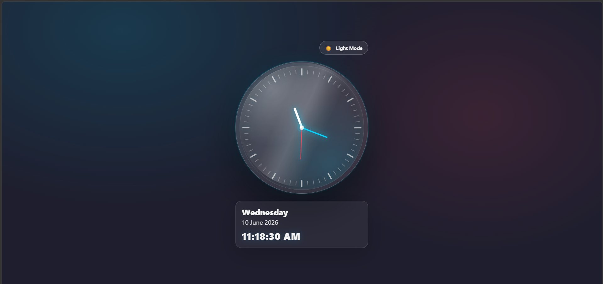

# Analog Clock 🕒

A modern Analog Clock built using HTML, CSS, and JavaScript. The clock displays real-time hours, minutes, and seconds with smooth hand movements and a clean glassmorphism-inspired UI.

## 🚀 Features

- Real-time Analog Clock
- Smooth second, minute, and hour hand rotation
- Digital Time Display
- Current Date Display
- Day Display
- Light/Dark Theme Toggle
- Modern Glassmorphism Design
- Responsive Layout
- Pure HTML, CSS, and JavaScript

---

## 🎯 Learning Outcomes

This project helped me practice:

- DOM Manipulation
- JavaScript Date Object
- CSS Positioning
- CSS Transforms & Rotation
- Real-Time Updates using setInterval()
- Responsive UI Design
- Theme Switching Logic

---

## 📸 Preview

