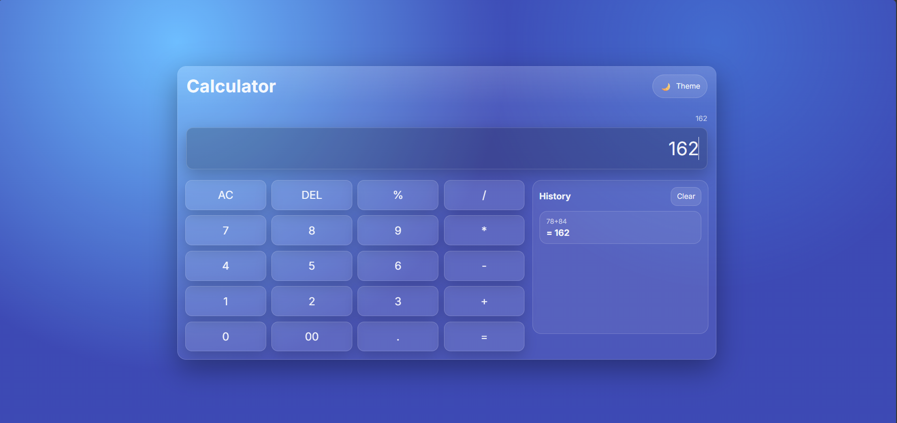

# Calculator 🧮

A modern Calculator built using HTML, CSS, and JavaScript. This project performs basic arithmetic operations with a clean and responsive user interface.

## 🚀 Features

- Addition, Subtraction, Multiplication, Division
- Percentage Calculations
- Decimal Number Support
- Delete (DEL) Function
- All Clear (AC) Function
- Calculation History
- Responsive Design
- Modern Glassmorphism UI
- Light/Dark Theme Toggle

---

## 🎯 Learning Outcomes

This project helped me practice:

- DOM Manipulation
- Event Handling
- JavaScript Functions
- Conditional Statements
- Array Operations
- Dynamic UI Updates
- Responsive Design
- Theme Switching

---

## 🔮 Future Improvements

- Scientific Calculator Functions
- Keyboard Support
- Memory Functions (M+, M-, MR)
- Calculation Export
- Multiple Themes
- Advanced Mathematical Operations

---

## 📸 Preview

