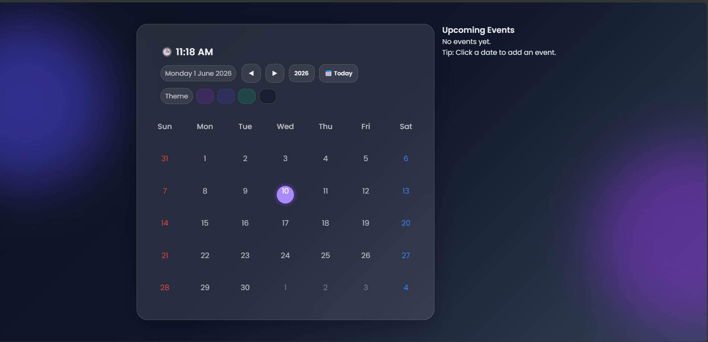

# Dynamic Calendar Pro 📅

A modern and interactive Dynamic Calendar built using HTML, CSS, and JavaScript. This project displays dates dynamically, allows month navigation, event management, theme customization, and provides a beautiful glassmorphism-inspired user interface.

## 🚀 Features

- Dynamic Calendar Generation
- Previous & Next Month Navigation
- Current Date Highlight
- Live Digital Clock
- Event Management
- Upcoming Events Section
- Theme Customization
- Responsive Design
- Glassmorphism UI
- Smooth User Experience

---

## 🎯 Learning Outcomes

This project helped me practice:

- JavaScript Date Object
- DOM Manipulation
- Event Handling
- Dynamic Rendering
- Local Storage
- Responsive Design
- Theme Switching
- UI/UX Design Principles

---

## 📸 Preview

