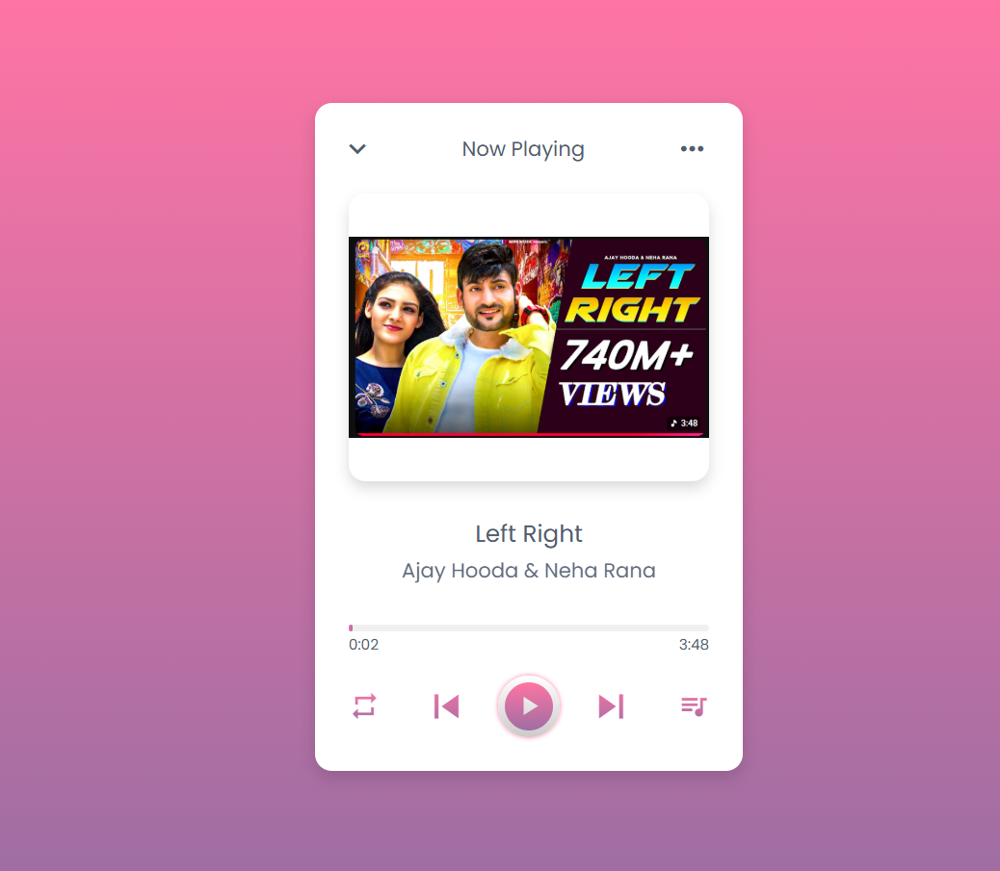

# Music Player Pro 🎵

A modern Music Player built using HTML, CSS, and JavaScript. This project allows users to play, pause, skip songs, manage playlists, and enjoy music through a beautiful and responsive user interface.

## 🚀 Features

- Play Songs
- Pause Songs
- Next & Previous Track Controls
- Dynamic Playlist
- Progress Bar
- Current Time & Duration Display
- Shuffle Mode
- Repeat Mode
- Album Cover Display
- Song Title & Artist Information
- Responsive Design
- Modern UI

---

## 🎯 Learning Outcomes

This project helped me practice:

- DOM Manipulation
- JavaScript Audio API
- Event Handling
- Dynamic Content Rendering
- Arrays & Objects
- Progress Bar Implementation
- Responsive UI Design
- Playlist Management

---

## 🎵 Controls

| Control | Function |
|----------|----------|
| ▶️ Play | Play Current Song |
| ⏸️ Pause | Pause Current Song |
| ⏭️ Next | Play Next Song |
| ⏮️ Previous | Play Previous Song |
| 🔀 Shuffle | Play Random Song |
| 🔁 Repeat | Repeat Current Song |

---

## 📸 Preview

