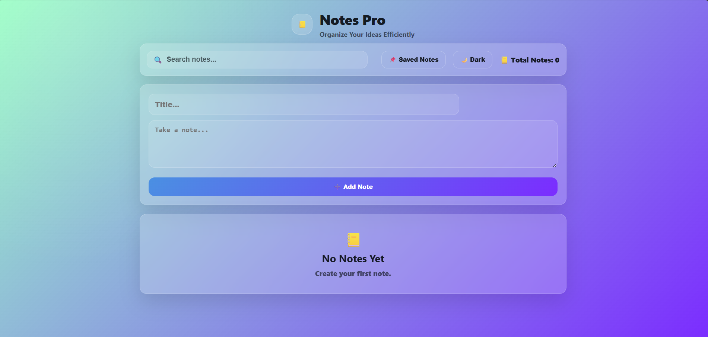

# Notes Pro 📝

A modern Notes App built using HTML, CSS, and JavaScript. This application helps users create, edit, organize, and manage notes efficiently with a clean and responsive user interface.

## 🚀 Features

- Create Notes
- Edit Notes
- Delete Notes
- Search Notes
- Pin Important Notes
- Copy Notes
- Notes Counter
- Created & Updated Date Tracking
- Local Storage Support
- Dark / Light Theme Toggle
- Responsive Design
- Modern Glassmorphism UI

---

## 🎯 Learning Outcomes

This project helped me practice:

- DOM Manipulation
- CRUD Operations
- Event Handling
- Local Storage
- Dynamic Rendering
- Search & Filtering
- Theme Switching
- Responsive UI Design

---

## 📌 Note Card Features

Each note card contains:

- Note Title
- Note Description
- Created Date
- Updated Date
- Pin Button
- Copy Button
- Edit Button
- Delete Button

---

## 📸 Preview

