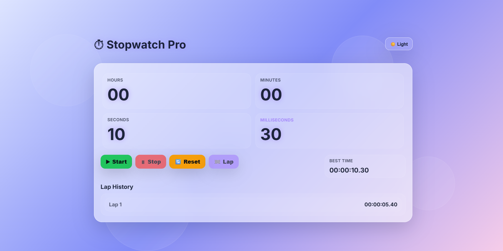

# Stopwatch Pro ⏱️

A modern Stopwatch Application built using HTML, CSS, and JavaScript. The application allows users to track time accurately, record laps, monitor best lap times, and enjoy a clean, responsive user interface.

## 🚀 Features

- Start Stopwatch
- Stop Stopwatch
- Reset Stopwatch
- Lap Recording
- Best Lap Tracking
- Real-Time Millisecond Precision
- Theme Toggle (Dark / Light Mode)
- Responsive Design
- Modern Dashboard UI
- Smooth User Experience

---

## 🎯 Learning Outcomes

This project helped me practice:

- DOM Manipulation
- JavaScript Timers
- Event Handling
- Dynamic UI Updates
- Time Formatting Logic
- Theme Switching
- Responsive Design

---

## 📊 Dashboard Information

The stopwatch displays:

- Hours
- Minutes
- Seconds
- Milliseconds
- Best Lap Time
- Total Laps

---

## 📸 Preview

