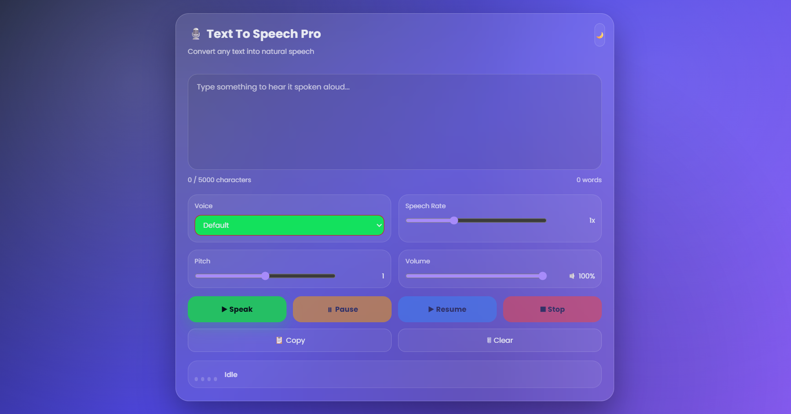

# Text To Speech Pro 🎙️

A modern Text-to-Speech Converter built using HTML, CSS, and JavaScript. This application converts written text into spoken audio using the browser's built-in Speech Synthesis API and provides multiple customization options for a better user experience.

## 🚀 Features

- Convert Text to Speech
- Voice Selection
- Speech Rate Control
- Pitch Control
- Volume Control
- Play Speech
- Pause Speech
- Resume Speech
- Stop Speech
- Character Counter
- Word Counter
- Copy Text
- Clear Text
- Theme Toggle (Dark / Light Mode)
- Responsive Design
- Modern Glassmorphism UI

---

## 🎯 Learning Outcomes

This project helped me practice:

- DOM Manipulation
- Event Handling
- JavaScript Functions
- Web Speech API
- Dynamic UI Updates
- Theme Switching
- Responsive Design
- Form Handling

---

## 📸 Preview

